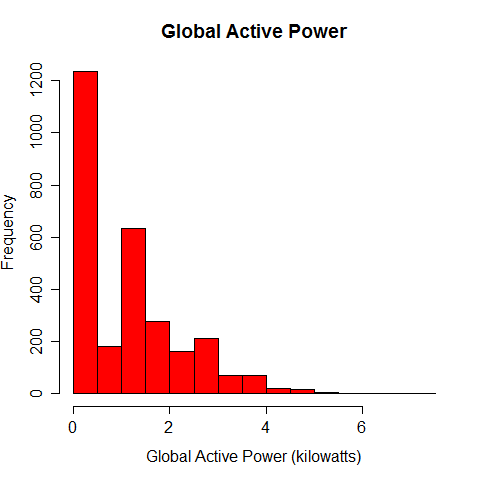
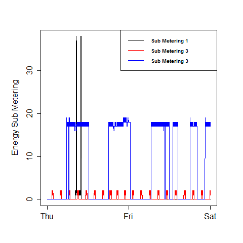
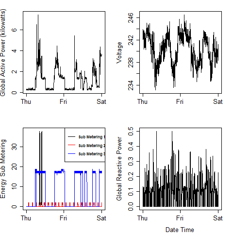

## Introduction

The four Charts and R files for the Exploratory Data Course on Coursera are here:

### Plot 1 Chart
 

### Plot 1 Code

```
#reads data from previously saved file
data <- read.table("household_power_consumption.txt",header=TRUE,sep=";")

#converts date to class date in a new column
data$newdate <- as.Date(data$Date,"%d/%m/%Y")

#subsets to tdata based on data conditional match
tData <- subset(data,data$newdate=="2007-02-01"|data$newdate=="2007-02-02")

#creates numeric class of Global active power in new column
tData$GAP <- as.numeric(as.character(tData$Global_active_power))

#plots hist plot from tData$GAP data with colours and labelling
hist(tData$GAP,col="red",main="Global Active Power",xlab="Global Active Power (kilowatts)",ylab="Frequency")

#copies plot to png device
dev.copy(png,file="plot1.png")

#closes device
dev.off()

```
### Plot 2 Chart
 

### Plot 2 Code

```
#reads data from previously saved file
data <- read.table("household_power_consumption.txt",header=TRUE,sep=";")

#converts date to class date in a new column
data$newdate <- as.Date(data$Date,"%d/%m/%Y")

#subsets to tdata based on data conditional match
tData <- subset(data,data$newdate=="2007-02-01"|data$newdate=="2007-02-02")

#creates numeric class of Global active power in new column
tData$GAP <- as.numeric(as.character(tData$Global_active_power))

#combines old date & time
tData$newDT <- paste(tData$Date,tData$Time,sep=";")

#converts newdate time with date time function and store in newDT1
tData$newDT1 <- strptime(tData$newDT,"%d/%m/%Y;%H:%M:%S")

#initiate plot
plot(tData$newDT1,tData$GAP,type="n",ylab="Global Active Power (kilowatts)",xlab="")

#draw lines on plot
lines(tData$newDT1,tData$GAP)

#copies plot to png device
dev.copy(png,file="plot2.png")

#closes device
dev.off()

```
### Plot 3 Chart
 

### Plot 3 Code

```
#reads data from previously saved file
data <- read.table("household_power_consumption.txt",header=TRUE,sep=";")

#converts date to class date in a new column
data$newdate <- as.Date(data$Date,"%d/%m/%Y")

#subsets to tdata based on data conditional match
tData <- subset(data,data$newdate=="2007-02-01"|data$newdate=="2007-02-02")

#creates numeric class of Global active power in new column
tData$GAP <- as.numeric(as.character(tData$Global_active_power))

#combines old date & time
tData$newDT <- paste(tData$Date,tData$Time,sep=";")

#converts newdate time with date time function and store in newDT1
tData$newDT1 <- strptime(tData$newDT,"%d/%m/%Y;%H:%M:%S")

# make numeric metering data
tData$sm1 <- as.numeric(as.character(tData$Sub_metering_1))
tData$sm2 <- as.numeric(as.character(tData$Sub_metering_2))
tData$sm3 <- as.numeric(as.character(tData$Sub_metering_3))

#initiate plot
plot(tData$newDT1,tData$sm1,type="n",ylab="Energy Sub Metering",xlab="")

#draw lines on plot
lines(tData$newDT1,tData$sm1,col="black")
lines(tData$newDT1,tData$sm2,col="red")
lines(tData$newDT1,tData$sm3,col="blue")
legend("topright",legend=c("Sub Metering 1","Sub Metering 3","Sub Metering 3"),c,col=c("black","red","blue"),lty=1,text.font=2,cex=0.64)

#copies plot to png device
dev.copy(png,file="plot3.png")

#closes device
dev.off()

```
### Plot 4 Chart
 

### Plot 4 Code

```
#reads data from previously saved file
data <- read.table("household_power_consumption.txt",header=TRUE,sep=";")

#converts date to class date in a new column
data$newdate <- as.Date(data$Date,"%d/%m/%Y")

#subsets to tdata based on data conditional match
tData <- subset(data,data$newdate=="2007-02-01"|data$newdate=="2007-02-02")

#creates numeric class of data to be used in charts
tData$GAP <- as.numeric(as.character(tData$Global_active_power))
tData$Volt <- as.numeric(as.character(tData$Voltage))
tData$GRP <- as.numeric(as.character(tData$Global_reactive_power))
tData$sm1 <- as.numeric(as.character(tData$Sub_metering_1))
tData$sm2 <- as.numeric(as.character(tData$Sub_metering_2))
tData$sm3 <- as.numeric(as.character(tData$Sub_metering_3))

#combines old date & time
tData$newDT <- paste(tData$Date,tData$Time,sep=";")

#converts newdate time with date time function and store in newDT1
tData$newDT1 <- strptime(tData$newDT,"%d/%m/%Y;%H:%M:%S")

#makes 2x2 column for plot
par(mfrow=c(2,2),mar=c(4,4,2,2))

#plot 1st line chart
plot(tData$newDT1,tData$GAP,type="n",ylab="Global Active Power (kilowatts)",xlab="")
lines(tData$newDT1,tData$GAP)

#plot 2nd line chart
plot(tData$newDT1,tData$Volt,type="n",ylab="Voltage",xlab="")
lines(tData$newDT1,tData$Volt)

#plot 3rd line chart
plot(tData$newDT1,tData$sm1,type="n",ylab="Energy Sub Metering",xlab="")
lines(tData$newDT1,tData$sm1,col="black")
lines(tData$newDT1,tData$sm2,col="red")
lines(tData$newDT1,tData$sm3,col="blue")
legend("topright",legend=c("Sub Metering 1","Sub Metering 3","Sub Metering 3"),c,col=c("black","red","blue"),lty=1,text.font=2,cex=0.64)

#plot 4th line chart
plot(tData$newDT1,tData$GRP,type="n",ylab="Global Reactive Power",xlab="")
lines(tData$newDT1,tData$GRP)

#copies plot to png device
dev.copy(png,file="plot4.png")

#closes device
dev.off()

```
